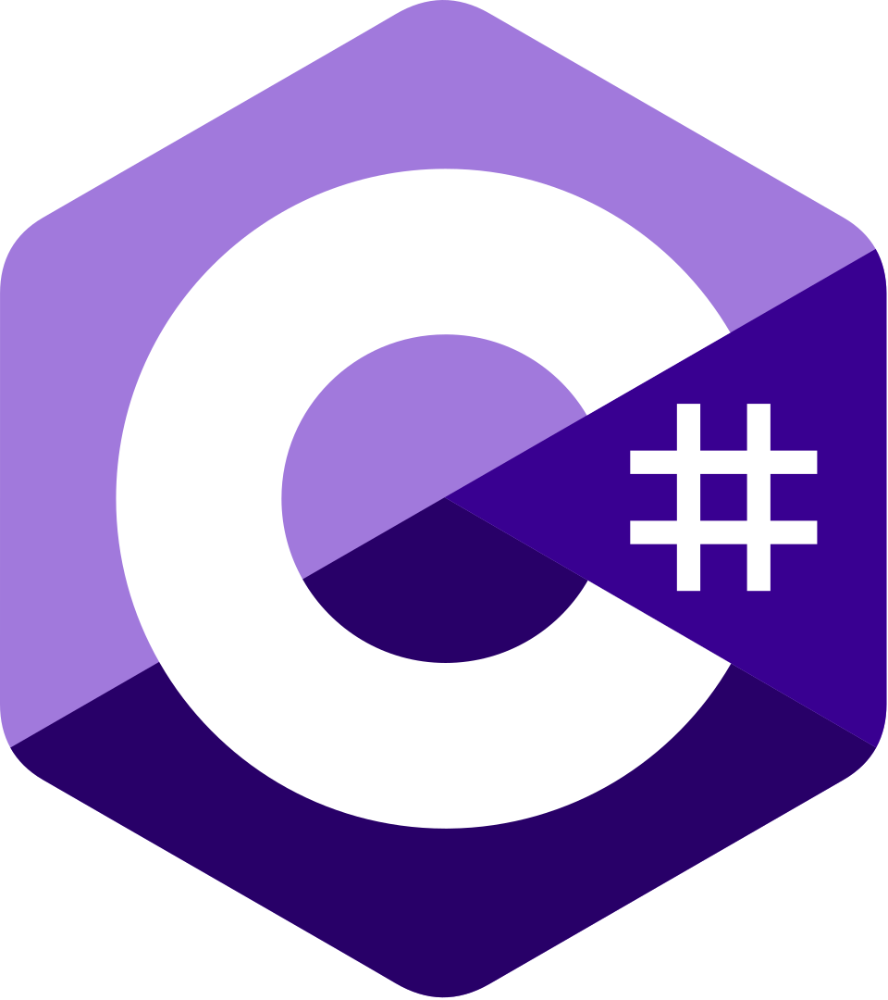

# Mrmariix

I am the owner of **Xylar Inc.** and the developer behind **XylarJava** and **XylarBedrock**.  ANND I am a member of the **ZenOS** project.

---

## Skills and Tech Stack

I have experience with C++, C#, JavaScript, and Python.

  
  &nbsp;&nbsp;&nbsp;
  
  &nbsp;&nbsp;&nbsp;
  
  &nbsp;&nbsp;&nbsp;
  

---

## Projects

### XylarJava & XylarBedrock
Dedicated projects focused on enhancing and managing different versions of the Minecraft ecosystem.

### ZenOS
I am an active contributor and member of the ZenOS project team.

  
  
  

---

## Social Media

  
  &nbsp;&nbsp;&nbsp;
  

---

**Disclaimer**: Xylar Inc. projects are independent and not officially affiliated with third-party software mentioned unless stated otherwise.
